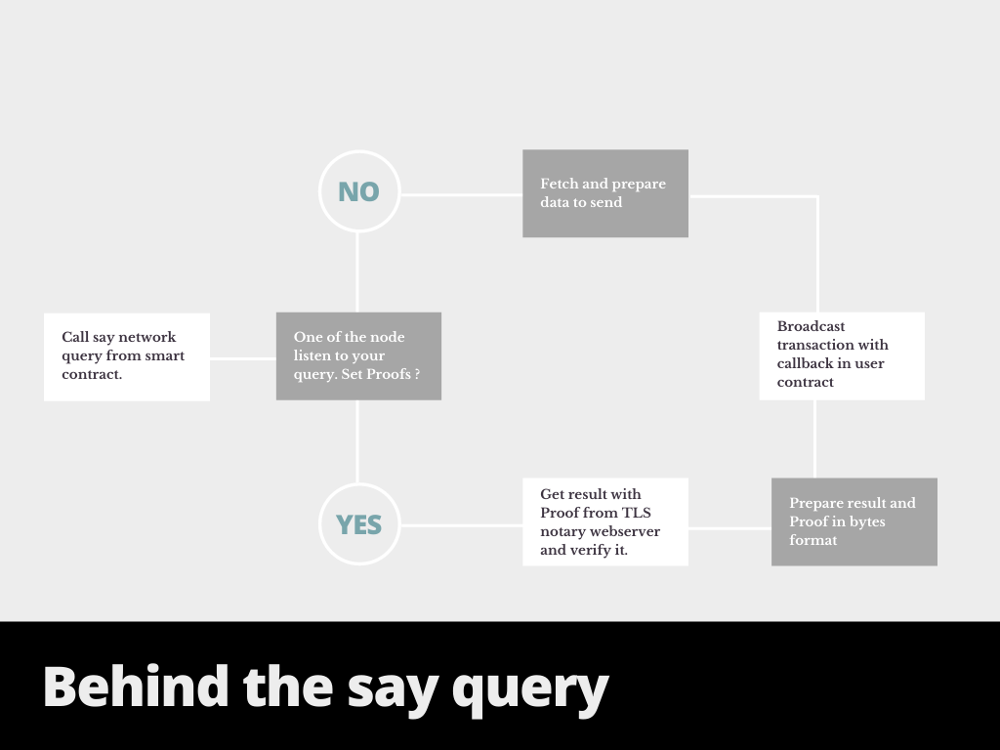

# Say Network Oracle service on Moonbeam

**Disclaimer:** Projects themselves entirely manage the content in this guide. Moonbeam is a permissionless network. Any project can deploy its contracts to Moonbeam.

## Introduction

Say network aims to bring the mechanism of provable (verifiable) oracles on top of newer compatible blockchains. With the help of cryptographic hash and advanced proofing techniques, data received by the blockchain will always be 100% trustworthy, proving that it's perfectly safe and provides the result from the trusless source.

Say network oracle service is now available on the Moonbase Alpha TestNet. Two types of oracle request models are available:

 - **Basic Query Model** — a basic model to listen then handle the request as per users provided arguments and then provide response with the data and a unique request id.
 - **Trustless Query Model** — it adds proofing layer in bytes on top of string result received by user to verify that the results are not tampered in any way. The proof verification mechanism is a little complicated for a new user currently but new mechanisms are in development to make verifiability of proofs easier.

Introduction & Quick start guide:

 - [Introduction](https://blog.say.network/introduction.html)
 - [Quick Start](https://blog.say.network/basic-price-feed.html)

You can read more about Say Network in the following links:

 - [Website](https://say.network/)
 - [Docs site](https://docs.say.network/)
 - [Blog site](https://blog.say.network/)
 - [Gists](https://gist.github.com/saynetwork)

You can contact the team via the following communication channels:

 - [Slack](https://networksay.slack.com/)
 - [Email](mailto:info@say.network)
 - [Twitter](https://twitter.com/network_say)

## Moonbase Alpha TestNet Implementation

Say Network oracle service and smart contracts are currently deployed on the Moonbase Alpha TestNet.

### Basic Request Model

You can find all the contract's addresses that are relevant Basic Request Model in the following table:

|  Contract           |   |                    Address                      |
|:-------------------:|---|:-----------------------------------------------:|
| OAR                 |   |   0xe9CdbDfB0afaBDd22E83c74214a228A480758345   |
| Oracle              |   |   0xa9974d2736a427ab3952D82E722BA653043812d6   |

To make a query in your smart contract. It is necessary to import [Saynetwork Moonbeam API](https://gist.github.com/saynetwork/3577ba1beb0a111ff3dba60d815b98ac) file in your smart contract.

You can use Remix and metamask to follow examples from official docs:

- [Query without proof](https://docs.say.network/moonbeam-testnet/basic-query)
- [Query with proof](https://docs.say.network/moonbeam-testnet/basic-query-with-proofs)

Say network - Behind your query ( This is about to get more complex :D ):

Once you ran query in your contract. The node will fulfill this request through `__callback()` method.

This API also provides the following methods:

 - **say_setProof** — set the proof for the contract you are calling from. say_query uses this value if you set it up or left it and based on it you will get response either with or without proof.
 - **say_getPrice** — returns the required gas price for the query as per the smart contract calculation of storing data.
 